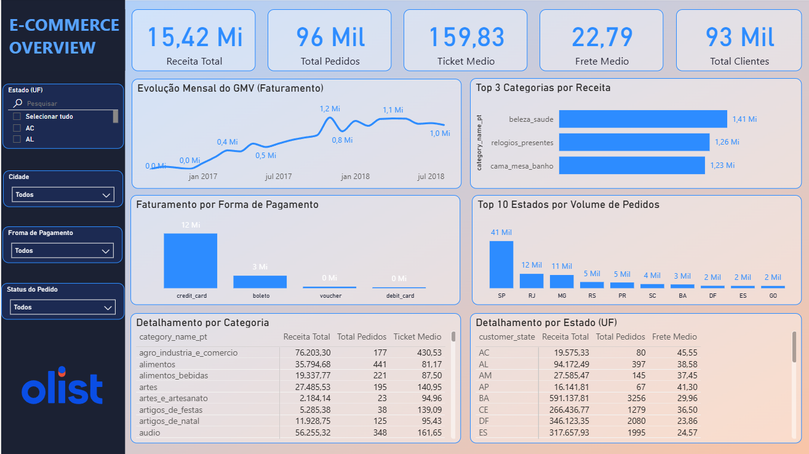

# 🛒 Olist E-Commerce End-to-End Analytics & BI

[](https://python.org)
[](https://sqlite.org)
[](https://powerbi.microsoft.com)
[](https://opensource.org/licenses/MIT)

Projeto ponta a ponta de engenharia de dados, modelagem dimensional e business intelligence desenvolvido sobre a base pública de e-commerce da Olist. O objetivo foi estruturar um pipeline ETL automatizado em Python, persistir os dados brutos e normalizados em SQLite, projetar um modelo em estrela (Star Schema) e construir um dashboard analítico executivo no Power BI para suporte à tomada de decisão.

---

## 📌 Visão Geral do Projeto

O projeto cobre todo o ciclo de vida analítico:
1. **Engenharia de Dados (ETL):** Ingestão de arquivos CSV relacionais para SQLite, limpeza, tratamento de granularidade de pedidos vs. itens e exportação de tabelas dimensionais otimizadas.
2. **Modelagem Dimensional:** Criação de tabelas fato e dimensões (`fact_orders`, `dim_products`, `dim_order_items`, `dim_order_payments`) para otimização de consultas analíticas e relatórios.
3. **Business Intelligence (Power BI):** Desenvolvimento de métricas avançadas em DAX e construção de um dashboard corporativo para análise de GMV, desempenho geográfico, categorias de produtos e meios de pagamento.

---

## 📊 Dashboard Executivo



### 💡 Principais Insights de Negócio & Recomendações

| Dimensão / Métrica | Valor Consolidado | Diagnóstico de Negócio | Ação Recomendada |
| :--- | :--- | :--- | :--- |
| **Volume & Clientes** | • **GMV:** R$ 15,42 Mi<br>• **Pedidos:** 96 Mil<br>• **Clientes Únicos:** 93 Mil | Proporção de ~1,03 pedidos por cliente único, evidenciando uma taxa de recompra e retenção quase nula. | Criar réguas de CRM pós-compra, programas de cashback e campanhas personalizadas de recompra. |
| **Logística & Frete** | • **Ticket Médio:** R$ 159,83<br>• **Frete Médio:** R$ 22,79 | O custo do frete representa **~14,2%** do valor médio do pedido, atuando como fricção no checkout. | Implementar política de frete grátis subsidiado para tickets acima de R$ 199,00. |
| **Sazonalidade** | • **Pico:** Nov/2017 (R$ 1,2 Mi) | Forte impacto promocional na Black Friday e consolidação do faturamento médio mensal em ~R$ 1,0 Mi em 2018. | Planejamento antecipado de estoque e parcerias com sellers chave a partir do Q3. |
| **Mix de Categorias** | • **1º** `beleza_saude` (R$ 1,41 Mi)<br>• **2º** `relogios_presentes` (R$ 1,26 Mi)<br>• **3º** `cama_mesa_banho` (R$ 1,23 Mi) | Três categorias concentram quase 25% do faturamento total da plataforma. | Focar atração e retenção de lojistas dessas categorias e criar estratégias de cross-sell. |
| **Meios de Pagamento** | • **Cartão de Crédito:** R$ 12 Mi (~78%)<br>• **Boleto:** R$ 3 Mi (~19%) | Grande dependência de crédito; débito e vouchers têm participação residual. | Oferecer descontos para pagamentos à vista (Pix/Boleto) para diminuir custos com taxas de adquirente. |
| **Concentração Regional** | • **SP:** 41 Mil pedidos (~42,7%)<br>• **RJ:** 12 Mil \| **MG:** 11 Mil | O Sudeste concentra mais de 65% de todo o volume transacionado. | Otimizar rotas logísticas e avaliar centros de distribuição parceiros no Sul e Nordeste. |

---

## 🏗️ Arquitetura e Modelagem de Dados

### Modelo Dimensional (Star Schema)

* **`fact_orders`** (Fato Principal): Grão consolidado de 1 linha por pedido contendo status, datas, valor total, frete total e contagem de itens.
* **`dim_products`** (Dimensão Produto): Categorias traduzidas, dimensões físicas e pesos dos itens.
* **`dim_order_items`** (Fato/Dimensão Transacional): Detalhamento individual de cada item vendido (preço unitário, frete unitário e seller).
* **`dim_order_payments`** (Dimensão de Pagamento): Modalidade, parcelamento e valor de cada transação.

---

## 📐 Medidas DAX Implementadas

```dax
-- Receita Total de Pedidos Entregues
Receita Total = 
CALCULATE(
    SUM(dim_order_items[price]) + SUM(dim_order_items[freight_value]),
    fact_orders[order_status] = "delivered"
)

-- Volume Total de Pedidos Entregues
Total Pedidos = 
CALCULATE(
    DISTINCTCOUNT(dim_order_items[order_id]),
    fact_orders[order_status] = "delivered"
)

-- Ticket Médio
Ticket Medio = DIVIDE([Receita Total], [Total Pedidos], 0)

-- Frete Médio Unitário
Frete Medio = 
DIVIDE(
    CALCULATE(
        SUM(dim_order_items[freight_value]),
        fact_orders[order_status] = "delivered"
    ),
    [Total Pedidos],
    0
)

-- Base de Clientes Únicos Atendidos
Total Clientes = 
CALCULATE(
    DISTINCTCOUNT(fact_orders[customer_unique_id]),
    fact_orders[order_status] = "delivered"
)
``` 
--- 

## 📁 Estrutura de Pastas
olist-ecommerce-analytics/  
├── dashboards/  
│   └── ecommerce_sales_overview.pbix   # Arquivo Power BI do relatório  
├── data/  
│   ├── processed/                      # Tabelas tratadas para o BI (CSVs e SQLite)  
│   └── raw/                            # Base de dados original (Olist CSVs)  
├── sql/  
│   ├── 01_data_profiling.sql           # Queries de exploração inicial  
│   └── 02_create_views.sql             # Definição de views SQL  
├── src/  
│   └── etl/  
│       ├── ingest_to_sqlite.py         # Script de carga inicial  
│       └── export_bi_tables.py         # Pipeline de transformação e exportação  
├── requirements.txt  
└── README.md  

--- 
## 🚀 Como Executar o Projeto

1. Clonar o Repositório & Criar Ambiente Virtual
```bash
git clone [https://github.com/SEU_USUARIO/olist-ecommerce-analytics.git](https://github.com/alinec-santos/olist-ecommerce-analytics.git)
cd olist-ecommerce-analytics

# Criar e ativar ambiente virtual
python -m venv venv
source venv/bin/activate  # Linux/Mac
.\venv\Scripts\activate   # Windows
```
2. Instalar Dependências
```bash
pip install -r requirements.txt
```
3. Executar o Pipeline de Dados
```bash
# Executa a limpeza, consolidação e exportação dos CSVs formatados
python src/etl/export_bi_tables.py
```
4. Abrir o Relatório
Abra o arquivo dashboards/ecommerce_sales_overview.pbix no Power BI Desktop para navegar pelo dashboard interativo.